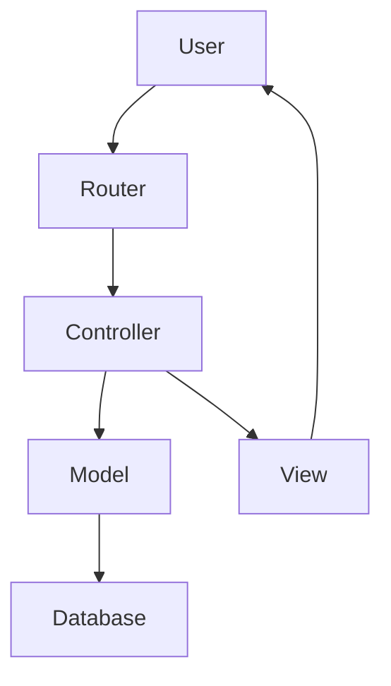

<div align="center">

# CesiStages
### Plateforme de Gestion de Stages - CESI


</div>

---

## 📋 Contexte du Projet

**CesiStages** est une solution web centralisée conçue pour simplifier le processus de recherche de stage au sein du campus CESI. 

Cette plateforme met en relation trois acteurs principaux :
*   **Les Étudiants** : Pour rechercher des offres, gérer leur wishlist et postuler en ligne.
*   **Les Entreprises** : Pour déposer des offres de stages et gagner en visibilité.
*   **Les Pilotes de formation** : Pour suivre les candidatures, valider les entreprises et accompagner les étudiants.

Le projet a été développé avec une architecture **MVC (Modèle-Vue-Contrôleur)** native, sans framework lourd, pour garantir légèreté et pédagogie.

---

## 📥 Installation Rapide

```bash
git clone https://github.com/web4all/cesi-stages.git
cd cesi-stages
composer install
```

---

## 📚 Documentation Complète

Pour une mise en place complète (Base de données, Emails, HTTPS, etc.), merci de suivre notre guide pas à pas :

1.  [**Prérequis & Installation**](docs/01_PREREQUIS_INSTALLATION.md)
    *Installation de Git, Composer et initialisation de la BDD.*

2.  [**Configuration .env**](docs/02_CONFIGURATION_ENV.md)
    *Sécurisation des identifiants et accès BDD.*

3.  [**Configuration Brevo (SMTP)**](docs/03_CONFIGURATION_BREVO.md)
    *Envoi d'emails transactionnels.*

4.  [**Configuration Google SSO**](docs/04_CONFIGURATION_GOOGLE.md)
    *Connexion via compte Google.*

5.  [**Configuration VHosts**](docs/05_CONFIGURATION_VHOSTS.md)
    *URL propre `http://cesi-site.local`.*

6.  [**Configuration HTTPS**](docs/06_CONFIGURATION_HTTPS.md)
    *Certificats SSL locaux.*

7.  [**Démarrage & Tests**](docs/07_DEMARRAGE.md)
    *Lancement et vérification.*

---

## 🏗️ Architecture du Projet

Le code source est organisé selon le patron de conception MVC pour séparer la logique, les données et l'affichage.



### Structure des dossiers

```text
cesi-stages/
├── config/             # Configuration globale et Routes
├── core/               # Noyau du framework maison (Router, Model, Controller)
├── src/                
│   ├── controllers/    # Logique métier (Auth, Offre, Etudiant...)
│   ├── models/         # Interaction BDD (Requêtes SQL)
│   └── views/          # Templates HTML/PHP
├── public/             # Racine web (index.php, CSS, JS, Assets)
├── database/           # Scripts SQL (Migrations et Seeds)
├── docs/               # Documentation technique détaillée
└── vendor/             # Dépendances Composer
```
