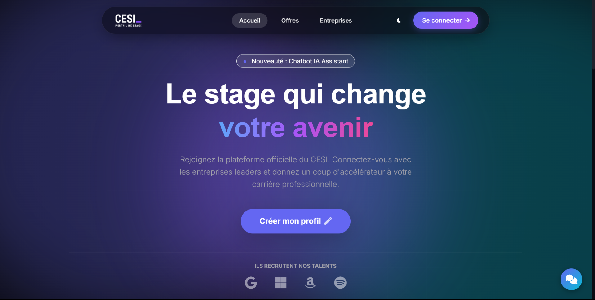
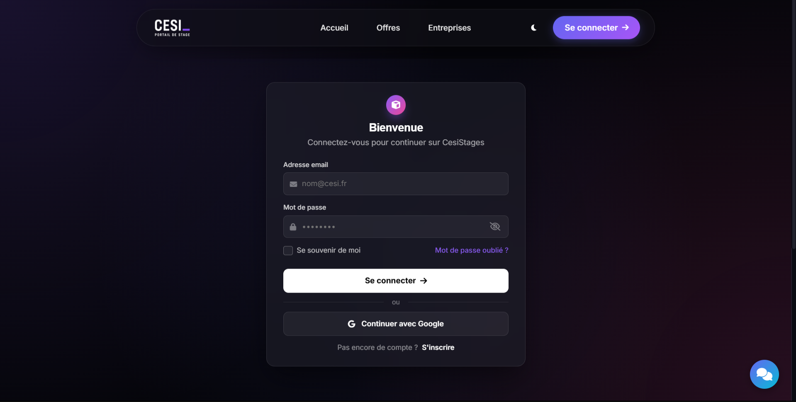
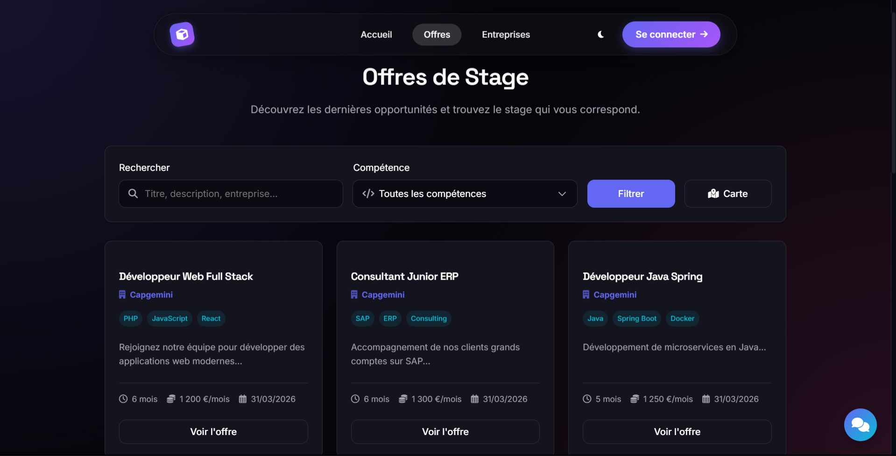

<div align="center">


# 🎓 CesiStages
**La Plateforme de Gestion de Stages pour le Campus CESI**

[](https://www.php.net/)
[](https://www.mysql.com/)
[](https://developer.mozilla.org/)
[](https://developer.mozilla.org/)
[](https://developer.mozilla.org/)
[](https://getcomposer.org/)

[](#-licence)
[]()

*Une solution MVC native, légère et performante, conçue sans framework lourd pour un apprentissage pédagogique optimal.*

</div>

---

## 📖 Sommaire

- [Contexte du Projet](#-contexte-du-projet)
- [Fonctionnalités Principales](#-fonctionnalités-principales)
- [Aperçu](#-aperçu)
- [Prérequis & Installation](#-prérequis--installation)
- [Architecture du Projet](#-architecture-du-projet)
- [Contribuer](#-contribuer)

---

## 📋 Contexte du Projet

**CesiStages** est une solution web centralisée conçue pour simplifier et moderniser le processus de recherche et de gestion des stages au sein du campus CESI. 

Cette plateforme met en relation quatre acteurs principaux via un système de rôles sécurisé :
* 🎓 **Les Étudiants** : Pour rechercher des offres, gérer leur wishlist, candidater en ligne et évaluer leurs expériences.
* 🏢 **Les Entreprises / Recruteurs** : Pour déposer des offres de stages, gérer les candidatures et gagner en visibilité auprès des étudiants.
* 👨‍🏫 **Les Pilotes de formation** : Pour suivre l'avancement des étudiants, gérer les groupes de promotion et valider les entreprises.
* ⚙️ **Les Administrateurs** : Pour la gestion globale de la plateforme, des utilisateurs et des permissions.

---

## ✨ Fonctionnalités Principales

- **Authentification & Sécurité** : Connexion classique et **SSO Google** (OAuth 2.0).
- **Gestion des Rôles (RBAC)** : Interface et permissions adaptées dynamiquement selon le profil (Étudiant, Pilote, Recruteur, Admin).
- **Tableaux de Bord** : Statistiques et suivi en temps réel pour les pilotes et étudiants.
- **Système de Candidature** : Upload de CV, lettres de motivation et suivi des statuts (En attente, Acceptée, Refusée).
- **Wishlist & Évaluations** : Mise en favoris des offres et système de notation des entreprises (1 à 5 étoiles).
- **Messagerie Interne** : Communication directe entre les acteurs de la plateforme.
- **Notifications** : Envoi d'emails transactionnels (via **Brevo SMTP**) pour les validations de compte et alertes.

---

## 📸 Aperçu


<div align="center">
  
  <br>
  <em>Accueil de la plateforme</em>
  <br><br>
  
  <br>
  <em>Page de connexion</em>
  <br><br>
  
  <br>
  <em>Vue des offres de stages</em>
</div>

---

## 📥 Prérequis & Installation

### Prérequis
* **PHP** >= 8.0
* **MySQL** / MariaDB
* **Composer**
* Serveur local (XAMPP, WAMP, Laragon, ou Apache/Nginx natif)

### Documentation & Déploiement

Pour procéder à l'installation complète du projet (clonage, configuration de la base de données, envoi d'emails SMTP, connexion Google SSO, mise en place des VHosts et du HTTPS), **veuillez vous rendre dans le dossier [`docs/`](docs/) et suivre les étapes indiquées dans l'ordre.**

👉 **[Accéder à la documentation d'installation détaillée](docs/)**

---

## 🏗️ Architecture du Projet

Le code source est organisé selon le patron de conception **MVC (Modèle-Vue-Contrôleur)** pour séparer rigoureusement la logique métier, l'accès aux données et l'affichage. Le projet utilise un système de routage personnalisé.

### Flux de données (Mermaid)

```mermaid
graph TD;
    User((Utilisateur))-->Router[Routeur HTTP];
    Router-->Controller[Contrôleur];
    Controller-->Model[Modèle];
    Model<-->Database[(Base de Données)];
    Controller-->View[Vue / HTML];
    View-->User;