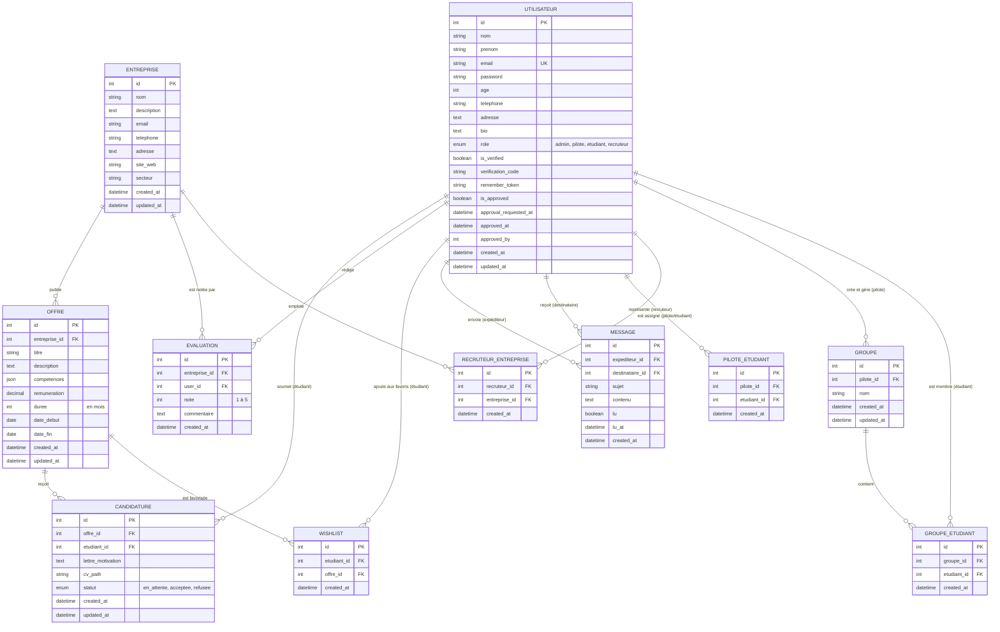

# 🗄️ Modèle Conceptuel de Données (MCD) - CesiStages

Ce document détaille l'architecture et la structure des données pour l'application **CesiStages**. Il sert de référence pour comprendre les entités, leurs attributs et les relations qui les unissent.

---

## 📊 Diagramme Conceptuel (Mermaid)

Ce diagramme illustre les entités et leurs relations (cardinalités). Les tables de liaison (issues des relations *Many-to-Many*) sont représentées comme des entités associatives pour plus de clarté.

---

## 📖 Dictionnaire des Données

### 1. Entités Principales

**UTILISATEUR (`users`)**
| Attribut | Type | Contraintes | Description |
|---|---|---|---|
| `id` | INT | Primary Key, Auto Increment | Identifiant unique |
| `nom` / `prenom` | VARCHAR(100) | Not Null | Identité de l'utilisateur |
| `email` | VARCHAR(255) | Unique, Not Null | Adresse email (sert d'identifiant de connexion) |
| `password` | VARCHAR(255) | Not Null | Mot de passe hashé |
| `age` | INT | Nullable | Âge de l'utilisateur |
| `telephone` | VARCHAR(20) | Nullable | Numéro de téléphone |
| `adresse` | TEXT | Nullable | Adresse postale |
| `bio` | TEXT | Nullable | Courte biographie/présentation |
| `role` | ENUM | Défaut: 'etudiant' | Rôle (`admin`, `pilote`, `etudiant`, `recruteur`) |
| `is_verified` / `verification_code` | BOOL / VARCHAR | - | Gestion de la vérification de l'email |
| `is_approved` / `approved_at` | TINYINT / DATETIME| - | Validation manuelle du compte (par un admin/pilote) |

**ENTREPRISE (`entreprises`)**
| Attribut | Type | Contraintes | Description |
|---|---|---|---|
| `id` | INT | Primary Key, Auto Increment | Identifiant unique |
| `nom` | VARCHAR(255) | Not Null | Raison sociale de l'entreprise |
| `description` | TEXT | Nullable | Description de l'entreprise |
| `email` / `telephone` | VARCHAR | Nullable | Coordonnées de contact génériques |
| `adresse` | TEXT | Nullable | Adresse du siège ou de l'agence |
| `site_web` | VARCHAR(255) | Nullable | URL du site internet |
| `secteur` | VARCHAR(100) | Nullable | Secteur d'activité principal |

**OFFRE (`offres`)**
| Attribut | Type | Contraintes | Description |
|---|---|---|---|
| `id` | INT | Primary Key, Auto Increment | Identifiant unique |
| `entreprise_id` | INT | Foreign Key | Lien vers l'entreprise émettrice |
| `titre` | VARCHAR(255) | Not Null | Intitulé du stage |
| `description` | TEXT | Not Null | Détail des missions |
| `competences` | JSON | Nullable | Liste structurée des compétences requises |
| `remuneration` | DECIMAL(10,2) | Défaut: 0 | Gratification mensuelle |
| `duree` | INT | Nullable | Durée du stage en mois |
| `date_debut` / `date_fin` | DATE | Nullable | Période du stage |

**GROUPE (`groupes`)**
| Attribut | Type | Contraintes | Description |
|---|---|---|---|
| `id` | INT | Primary Key, Auto Increment | Identifiant unique |
| `pilote_id` | INT | Foreign Key | Pilote responsable du groupe |
| `nom` | VARCHAR(255) | Not Null | Nom de la promotion ou du groupe |

---

### 2. Entités Associatives (Tables de liaison)

| Entité / Table | Description des champs clés et du rôle |
|---|---|
| **CANDIDATURE** (`candidatures`) | Lie un `Etudiant` à une `Offre`. Stocke la `lettre_motivation`, le `cv_path` et le `statut` (`en_attente`, `acceptee`, `refusee`). *Unicité : un étudiant ne peut postuler qu'une fois à une offre.* |
| **EVALUATION** (`evaluations`) | Lie un `Utilisateur` (étudiant/pilote) à une `Entreprise`. Stocke une `note` (1 à 5) et un `commentaire`. *Unicité : un utilisateur ne note une entreprise qu'une fois.* |
| **MESSAGE** (`messages`) | Gère la messagerie interne. Lie deux `Utilisateurs` (`expediteur_id`, `destinataire_id`). Contient `sujet`, `contenu`, et l'état de lecture (`lu`, `lu_at`). |
| **WISHLIST** (`wishlist`) | Système de favoris. Lie un `Etudiant` à une `Offre`. *Unicité : une offre ne peut être qu'une fois dans la liste d'un même étudiant.* |
| **PILOTE_ETUDIANT** (`pilote_etudiant`) | Lie un `Pilote` à un `Etudiant` pour définir qui encadre qui en dehors d'une logique de groupe. |
| **RECRUTEUR_ENTREPRISE** (`recruteur_entreprise`) | Lie un profil `Recruteur` à une ou plusieurs `Entreprises`. Permet de gérer les droits d'édition des offres. |
| **GROUPE_ETUDIANT** (`groupe_etudiant`) | Assigne un `Etudiant` à un `Groupe`. *Unicité : un étudiant ne peut être qu'une fois dans un groupe.* |

---

## 🔗 Règles de gestion et Cardinalités

### Gestion des Utilisateurs et Rôles
* **Encadrement** : Un `Pilote` peut encadrer plusieurs `Étudiants` (1,N). Un `Étudiant` peut être encadré par plusieurs `Pilotes` (1,N).
* **Groupes** : Un `Pilote` crée et gère un ou plusieurs `Groupes` (1,N). Un `Groupe` est composé de plusieurs `Étudiants` (1,N).
* **Recrutement** : Un `Recruteur` peut être rattaché à une ou plusieurs `Entreprises` (1,N). Une `Entreprise` peut avoir plusieurs `Recruteurs` (1,N).

### Offres et Candidatures
* **Publication** : Une `Entreprise` peut publier plusieurs `Offres` (1,N). Une `Offre` appartient obligatoirement à une seule `Entreprise` (1,1).
* **Candidature** : Un `Étudiant` peut soumettre plusieurs `Candidatures` (0,N). Une `Offre` peut recevoir plusieurs `Candidatures` (0,N). L'unicité garantit qu'un étudiant ne postule pas deux fois à la même offre.
* **Favoris (Wishlist)** : Un `Étudiant` peut mettre plusieurs `Offres` en favoris (0,N).

### Évaluations et Communication
* **Évaluation** : Un `Utilisateur` peut évaluer plusieurs `Entreprises` (0,N). Une `Entreprise` peut recevoir plusieurs `Évaluations` (0,N).
* **Messagerie** : Un `Utilisateur` peut envoyer (0,N) et recevoir (0,N) des messages vers/depuis d'autres `Utilisateurs`.

